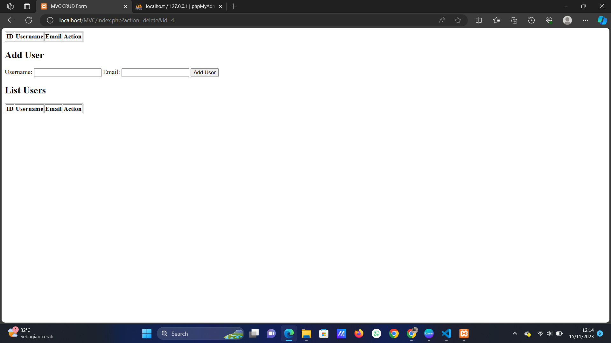
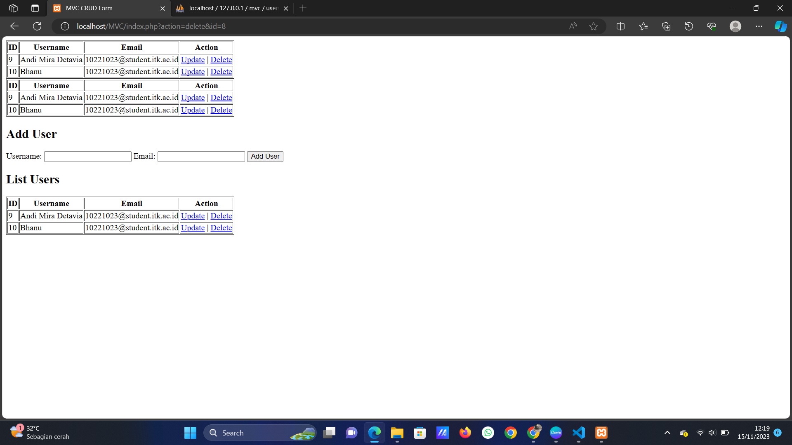
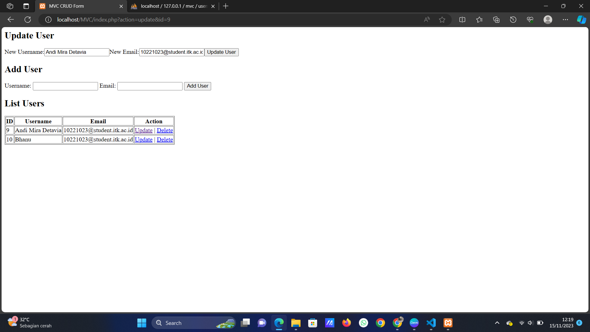
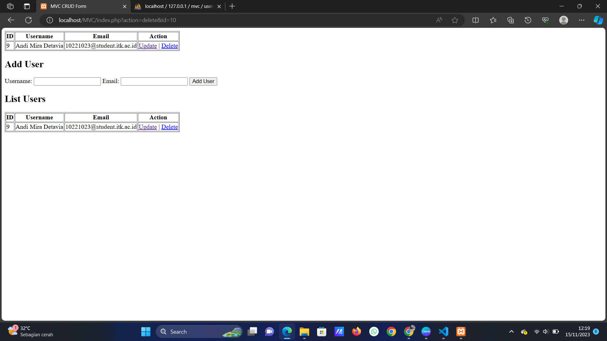

# TUGAS PRAKTIKUM CRUD-MVC-PHP WEEK 11

## Nama : Andi Mira Detavia
## NIM : 10221023
## Kelas : PBO A

### *Tugas :*
MVC (Model View Controller) adalah pendekatan yang umum digunakan dalam pengembangan web untuk membuat aplikasi lebih terstruktur dan mudah di-maintain. Berikut adalah panduan umum untuk membuat struktur MVC dengan PHP:

- Model (M): Buat direktori atau folder untuk model. Model adalah bagian yang berhubungan dengan logika bisnis dan interaksi dengan database. Buat kelas-kelas dalam model untuk merepresentasikan entitas seperti objek database atau tabel. Misalnya, jika Anda memiliki tabel "produk," buat kelas "Product" untuk mengelola data produk. Dalam kelas model, Anda dapat menulis metode untuk mengakses, menyimpan, memperbarui, dan menghapus data dari database.
- View (V): Buat direktori atau folder untuk view. View adalah bagian yang berhubungan dengan tampilan atau antarmuka pengguna. Buat berkas-berkas template HTML yang akan digunakan untuk menampilkan data kepada pengguna. Anda dapat menggunakan bahasa templating seperti PHP, Twig, atau Blade untuk menggabungkan data dari model ke dalam tampilan.
- Controller (C): Buat direktori atau folder untuk controller. Controller adalah bagian yang berfungsi sebagai pengontrol lalu lintas dalam aplikasi. Buat kelas-kelas dalam controller untuk mengelola permintaan pengguna, mengambil data dari model, dan mengirimkan data ke tampilan. Dalam kelas controller, Anda dapat mendefinisikan metode yang menerima permintaan HTTP (misalnya, GET atau POST), memproses input pengguna, dan mengarahkan ke tampilan yang sesuai.

### *Tampilan :*
Gambar dibawah merupakan tampilan awalnya

<br></br>
Gambar dibawah merupakan tampilan ketika sudah diinput, inputan mucul 2 tabel karena pada fungsi adduser memanggil fungsi list user. 

<br></br>
Gambar dibawah merupakan tampilan ketika pengguna ingin mengedit atau mengubah username atau emailnya.

<br></br>
<br></br>
Gambar dibawah merupakan tampilan delete ketika nama dengan username "Bhanu" dihapus.

<br></br>

### *Code Source :*

## Membuat Folder MVC dan Database dalam mysql, dengan nama Database 'MVC' dan table 'id', 'username' dan 'email'.

### Membuat folder Config 

#### -> file Database.php

```php
Config/Database.php

<?php

namespace Config;

class Database {
    public static function connect() {
        $host = 'localhost';
        $dbname = 'mvc';
        $username = 'root';
        $password = '';

        try {
            $pdo = new \PDO("mysql:host=$host;dbname=$dbname", $username, $password);
            $pdo->setAttribute(\PDO::ATTR_ERRMODE, \PDO::ERRMODE_EXCEPTION);
            return $pdo;
        } catch (\PDOException $e) {
            die("Connection failed: " . $e->getMessage());
        }
    }
}
```
</br>

### Membuat folder Controllers 

#### -> file UserController.php

```php
Controllers/UserController.php

<?php

namespace Controllers;

use Models\UserModel;
use Views\UserView;

class UserController {
    private $model;
    private $view;

    public function __construct() {
        $this->model = new UserModel();
        $this->view = new UserView();
    }

    public function getModel() {
        return $this->model;
    }

    public function listUsers() {
        $users = $this->model->getAllUsers();
        $this->view->displayUsers($users);
    }

    public function showUser($userId) {
        $user = $this->model->getUserById($userId);
        $this->view->displayUser($user);
    }

    public function addUser($userData) {
        $this->model->addUser($userData);
        $this->listUsers();
    }

    public function updateUser($userId, $userData) {
        $this->model->updateUser($userId, $userData);
        $this->showUser($userId);
    }

    public function deleteUser($userId) {
        $this->model->deleteUser($userId);
        $this->listUsers();
    }
}
```
</br>

### Membuat folder Models 

#### -> file UserModel.php

```php
Models/UserModel.php

<?php

namespace Models;

use Config\Database;

class UserModel {
    public function getAllUsers() {
        $pdo = Database::connect();
        $stmt = $pdo->query('SELECT * FROM users');
        return $stmt->fetchAll(\PDO::FETCH_ASSOC);
    }

    public function getUserById($userId) {
        $pdo = Database::connect();
        $stmt = $pdo->prepare('SELECT * FROM users WHERE id = :id');
        $stmt->bindParam(':id', $userId);
        $stmt->execute();
        return $stmt->fetch(\PDO::FETCH_ASSOC);
    }

    public function addUser($userData) {
        $pdo = Database::connect();
        $stmt = $pdo->prepare('INSERT INTO users (username, email) VALUES (:username, :email)');
        $stmt->bindParam(':username', $userData['username']);
        $stmt->bindParam(':email', $userData['email']);
        $stmt->execute();
    }

    public function updateUser($userId, $userData) {
        $pdo = Database::connect();
        $stmt = $pdo->prepare('UPDATE users SET username = :username, email = :email WHERE id = :id');
        $stmt->bindParam(':username', $userData['username']);
        $stmt->bindParam(':email', $userData['email']);
        $stmt->bindParam(':id', $userId);
        $stmt->execute();
    }

    public function deleteUser($userId) {
        $pdo = Database::connect();
        $stmt = $pdo->prepare('DELETE FROM users WHERE id = :id');
        $stmt->bindParam(':id', $userId);
        $stmt->execute();
    }
}
```
</br>

### Didalam folder vendor 

#### -> file autoload.php

##### Dimana folder vendor sendiri akan muncul setelah menginstall composer.

```php
vendor/autoload.php
<?php

// autoload.php @generated by Composer

if (PHP_VERSION_ID < 50600) {
    if (!headers_sent()) {
        header('HTTP/1.1 500 Internal Server Error');
    }
    $err = 'Composer 2.3.0 dropped support for autoloading on PHP <5.6 and you are running '.PHP_VERSION.', please upgrade PHP or use Composer 2.2 LTS via "composer self-update --2.2". Aborting.'.PHP_EOL;
    if (!ini_get('display_errors')) {
        if (PHP_SAPI === 'cli' || PHP_SAPI === 'phpdbg') {
            fwrite(STDERR, $err);
        } elseif (!headers_sent()) {
            echo $err;
        }
    }
    trigger_error(
        $err,
        E_USER_ERROR
    );
}

require_once __DIR__ . '/composer/autoload_real.php';

return ComposerAutoloaderInitc712564a4f4e747a78065dd2c51ad4ab::getLoader();
```
### Membuat folder Views 

#### -> file UserViews.php

```php
Views/UserViews.php
<?php

namespace Views;

class UserView {
    public function displayUsers($users) {
        echo "<table border='1'>";
        echo "<tr><th>ID</th><th>Username</th><th>Email</th><th>Action</th></tr>";
        foreach ($users as $user) {
            echo "<tr>";
            echo "<td>{$user['id']}</td>";
            echo "<td>{$user['username']}</td>";
            echo "<td>{$user['email']}</td>";
            echo "<td><a href='index.php?action=update&id={$user['id']}'>Update</a> | <a href='index.php?action=delete&id={$user['id']}'>Delete</a></td>";
            echo "</tr>";
        }
        echo "</table>";
    }

    public function displayUser($user) {
        if ($user === null) {
            echo "User not found.";
        } else {
            echo "ID: {$user['id']}, Username: {$user['username']}, Email: {$user['email']}<br>";
        }
    }
}
```
### Didalam folder MVC 

#### -> file index.php

```php
<?php

require_once 'vendor/autoload.php';

use Controllers\UserController;

$userController = new UserController();

if ($_SERVER['REQUEST_METHOD'] === 'POST') {
    if (isset($_POST['addUser'])) {
        // Tambah Pengguna
        $userController->addUser(['username' => $_POST['username'], 'email' => $_POST['email']]);
    } elseif (isset($_POST['updateUser'])) {
        // Perbarui Pengguna dengan ID tertentu
        $userController->updateUser($_POST['userId'], ['username' => $_POST['username'], 'email' => $_POST['email']]);
    } elseif (isset($_POST['deleteUser'])) {
        // Hapus Pengguna dengan ID tertentu
        $userController->deleteUser($_POST['userId']);
    }
}

if (isset($_GET['action']) && isset($_GET['id'])) {
    $action = $_GET['action'];
    $userId = $_GET['id'];

    if ($action === 'update') {
        // Tampilkan formulir update
        $user = $userController->getModel()->getUserById($userId);
        echo "<h2>Update User</h2>";
        echo "<form method='post' action=''>";
        echo "<input type='hidden' name='userId' value='{$user['id']}'>";
        echo "<label for='username'>New Username:</label>";
        echo "<input type='text' name='username' value='{$user['username']}' required>";
        echo "<label for='email'>New Email:</label>";
        echo "<input type='email' name='email' value='{$user['email']}' required>";
        echo "<button type='submit' name='updateUser'>Update User</button>";
        echo "</form>";
    } elseif ($action === 'delete') {
        // Hapus pengguna
        $userController->deleteUser($userId);
    }
}

// Tampilkan Formulir
?>

<!DOCTYPE html>
<html lang="en">
<head>
    <meta charset="UTF-8">
    <meta name="viewport" content="width=device-width, initial-scale=1.0">
    <title>MVC CRUD Form</title>
</head>
<body>

<h2>Add User</h2>
<form method="post" action="">
    <label for="username">Username:</label>
    <input type="text" name="username" required>
    <label for="email">Email:</label>
    <input type="email" name="email" required>
    <button type="submit" name="addUser">Add User</button>
</form>

<h2>List Users</h2>
<?php
// Tampilkan daftar pengguna
$userController->listUsers();
?>

</body>
</html>
```
### Didalam folder MVC 

#### -> file composer.json

```json
{
    "require": {
        "ext-pdo": "*",
        "ext-pdo_mysql": "*"
    },
    "autoload": {
        "psr-4": {
            "Controllers\\": "Controllers/",
            "Models\\": "Models/",
            "Views\\": "Views/",
            "Config\\": "Config"
        }
    }
}
```


