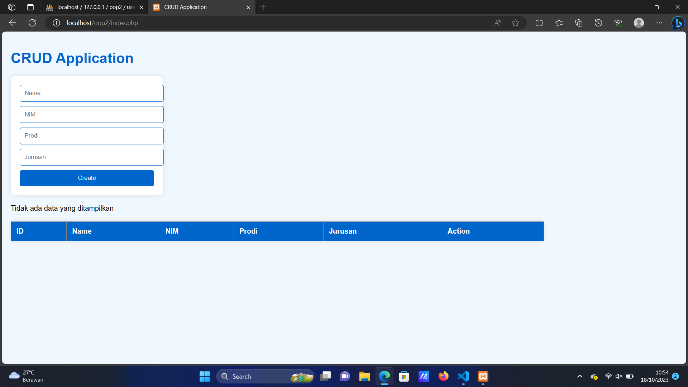
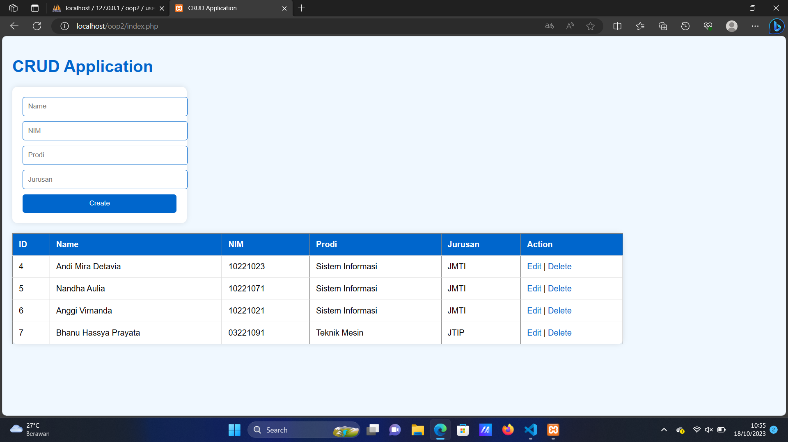
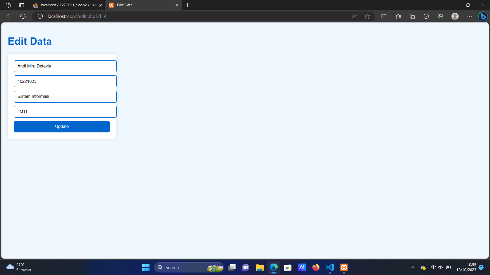
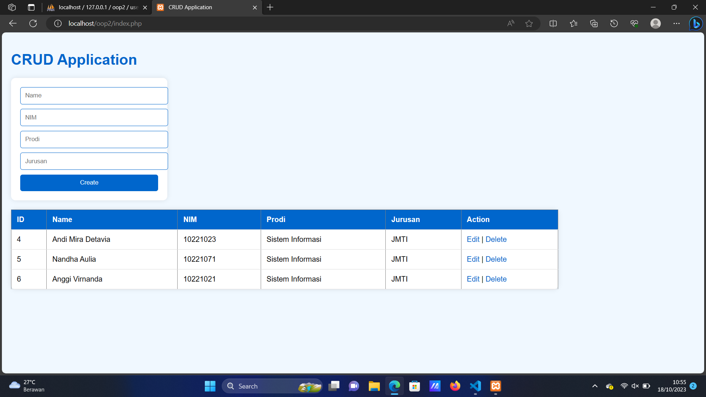

# TUGAS PRAKTIKUM CRUD-OOP-PHP WEEK 10

## Nama : Andi Mira Detavia
## NIM : 10221023
## Kelas : PBO A

### *Tugas :*
1. Membuat CRUD dengan menggunakan OOP PHP seperti yang sudah dipelajari.
2. Informasi data yang ada pada website adalah nama, nim, program studi, dan jurusan.
3. Menambahkan CSS/Bootstrap.
4. Penulisan laporan harus menampilkan penjelasan dari kode dan juga screenshoot hasil.
5. Laporan ditulis dengan menggunakan Markdown dan dikumpulkan dengan format pdf.

### *Tampilan :*



<br></br>



<br></br>



<br></br>



<br></br>

### *Code Source :*

#### Membuat CRUD

```php
index.php

<?php
require 'classes/Database.php';
require 'classes/CRUD.php';

// Inisialisasi objek CRUD
$crud = new CRUD();

// Handle Create
if (isset($_POST['create'])) {
    $name = $_POST['name'];
    $nim = $_POST['nim'];
    $prodi = $_POST['prodi'];
    $jurusan = $_POST['jurusan'];
    $crud->create($name, $nim, $prodi, $jurusan);
}

// Tampilkan data dari database
$result = $crud->read();
?>

<!DOCTYPE html>
<html>
<head>
<style>
        body {
            font-family: Arial, sans-serif;
            background-color: #f0f8ff; /* Light blue */
            margin: 0;
            padding: 20px;
        }

        h1 {
            color: #0066cc; /* Darker blue */
        }

        form {
            width: 300px;
            background-color: white;
            padding: 20px;
            border-radius: 10px;
            box-shadow: 0 0 10px rgba(0, 0, 0, 0.1);
            margin-bottom: 20px;
        }

        form input[type="text"] {
            width: 100%;
            padding: 10px;
            margin-bottom: 10px;
            border: 1px solid #0066cc; /* Darker blue */
            border-radius: 5px;
        }

        form button {
            width: 100%;
            padding: 10px;
            background-color: #0066cc; /* Darker blue */
            color: white;
            border: none;
            border-radius: 5px;
            cursor: pointer;
        }

        table {
            width: 80%;
            border-collapse: collapse;
            margin-top: 20px;
            background-color: white;
            box-shadow: 0 0 10px rgba(0, 0, 0, 0.1);
            border-radius: 10px;
        }

        th, td {
            padding: 12px;
            text-align: left;
            border-bottom: 1px solid #dddddd;
        }

        th {
            background-color: #0066cc; /* Darker blue */
            color: white;
        }

        tr:hover {
            background-color: #e0f7fa; /* Lighter blue on hover */
        }

        a {
            color: #0066cc; /* Darker blue */
            text-decoration: none;
        }

        a:hover {
            color: #003366; /* Slightly darker blue on hover */
            text-decoration: underline;
        }
    </style>
    <title>CRUD Application</title>
</head>
<body>
    <h1>CRUD Application</h1>

    <form action="index.php" method="POST">
        <input type="text" name="name" placeholder="Name">
        <input type="text" name="nim" placeholder="NIM">
        <input type="text" name="prodi" placeholder="Prodi">
        <input type="text" name="jurusan" placeholder="Jurusan">
        <button type="submit" name="create">Create</button>
    </form>

    <table border="1">
        <tr>
            <th>ID</th>
            <th>Name</th>
            <th>NIM</th>
            <th>Prodi</th>
            <th>Jurusan</th>
            <th>Action</th>
        </tr>
        <?php
        if ($result->num_rows > 0) {
            while ($row = $result->fetch_assoc()) {
                echo "<tr>";
                echo "<td>" . $row['id'] . "</td>";
                echo "<td>" . $row['name'] . "</td>";
                echo "<td>" . $row['nim'] . "</td>";
                echo "<td>" . $row['prodi'] . "</td>";
                echo "<td>" . $row['jurusan'] . "</td>";
                echo "<td><a href='edit.php?id=" . $row['id'] . "'>Edit</a> | <a href='delete.php?id=" . $row['id'] . "'>Delete</a></td>";
                echo "</tr>";
            }
        } else {
            echo "Tidak ada data yang ditampilkan";
        }
        ?>
    </table>
</body>
</html>
?>
```
Penjelasan : File diatas merupakan file utama atau sebuah tampilan utama sebagai menampilkan antarmuka yang digunakan untuk berinteraksi dengan users.

```php
edit.php

<?php
require 'classes/Database.php';
require 'classes/CRUD.php';

// Inisialisasi objek CRUD
$crud = new CRUD();

if (isset($_GET['id'])) {
    $id = $_GET['id'];

    if (isset($_POST['update'])) {
        $name = $_POST['Name'];
        $nim = $_POST['NIM'];
        $prodi = $_POST['Prodi'];
        $jurusan = $_POST['Jurusan'];
        $crud->update($id, $name, $nim, $prodi, $jurusan);
        header("Location: index.php");
    }

    $result = $crud->read();
    $data = $result->fetch_assoc();
} else {
    header("Location: index.php");
}
?>

<!DOCTYPE html>
<html>
<head>
<style>
        body {
            font-family: Arial, sans-serif;
            background-color: #f0f8ff; /* Light blue */
            margin: 0;
            padding: 20px;
        }

        h1 {
            color: #0066cc; /* Darker blue */
        }

        form {
            width: 300px;
            background-color: white;
            padding: 20px;
            border-radius: 10px;
            box-shadow: 0 0 10px rgba(0, 0, 0, 0.1);
            margin-bottom: 20px;
        }

        form input[type="text"] {
            width: 100%;
            padding: 10px;
            margin-bottom: 10px;
            border: 1px solid #0066cc; /* Darker blue */
            border-radius: 5px;
        }

        form button {
            width: 100%;
            padding: 10px;
            background-color: #0066cc; /* Darker blue */
            color: white;
            border: none;
            border-radius: 5px;
            cursor: pointer;
        }
        
        form button:hover {
            background-color: #005bb5; /* Slightly darker blue on hover */
        }

    </style>
<title>Edit Data</title>
</head>
<body>
    <h1>Edit Data</h1>
    <form action="edit.php?id=<?php echo $id; ?>" method="POST">
        <input type="text" name="Name" placeholder="Name" value="<?php echo $data['name']; ?>">
        <input type="text" name="NIM" placeholder="NIM" value="<?php echo $data['nim']; ?>">
        <input type="text" name="Prodi" placeholder="Prodi" value="<?php echo $data['prodi']; ?>">
        <input type="text" name="Jurusan" placeholder="Jurusan" value="<?php echo $data['jurusan']; ?>">
        <button type="submit" name="update">Update</button>
    </form>
</body>
</html>
```
Penjelasan : File diatas merupakan file untuk menangani sebuah keinginan users untuk mengedit datanya dan juga menampilkan antarmuka untuk users dapat mengedit datanya.

```php
delete.php

<?php
require 'classes/Database.php';
require 'classes/CRUD.php';

// Inisialisasi objek CRUD
$crud = new CRUD();

if (isset($_GET['id'])) {
    $id = $_GET['id'];
    $crud->delete($id);
    header("Location: index.php");
} else {
    header("Location: index.php");
}
?>
```

Penjelasan : File diatas merupakan file untuk menangani sebuah keinginan users untuk menghapus datanya.

#### Membuat Classes

```php
CRUD.php

<?php
class CRUD extends Database {
    public function create($name, $nim, $prodi, $jurusan) {
        $query = "INSERT INTO users (name, nim, prodi, jurusan) VALUES ('$name', '$nim', '$prodi', '$jurusan')";
        return $this->conn->query($query);
    }

    public function read() {
        $query = "SELECT * FROM users";
        return $this->conn->query($query);
    }

    public function update($id, $name, $nim, $prodi, $jurusan) {
        $query = "UPDATE users SET name = '$name', nim = '$nim', prodi = '$prodi', jurusan = '$jurusan' WHERE id = $id";
        return $this->conn->query($query);
    }

    public function delete($id) {
        $query = "DELETE FROM users WHERE id = $id";
        return $this->conn->query($query);
    }
}
?>
```
Penjelasan : File ini berfungsi untuk membuat penanganan dalam sebuah file CRUD yang dibuat dengan menggunakan OOP.

```php
Database.php

<?php
class Database {
    private $host = 'localhost';
    private $username = 'root';
    private $password = '';
    private $dbname = 'oop2';
    protected $conn;

    public function __construct() {
        $this->conn = new mysqli($this->host, $this->username, $this->password, $this->dbname);
        if ($this->conn->connect_error) {
            die("Koneksi database gagal: " . $this->conn->connect_error);
        }
    }
}
```
Penjelasan : File diatas merupakan file yang berfungsi sebagai konektivitas ke dalam sebuah database yang sudah kita buat di dalam phpmyadmin.

#### Membuat Templates

```html
index.html

<!DOCTYPE html>
<html>
<head>
    <title>CRUD Application</title>
</head>
<body>
    <h1>CRUD Application</h1>

    <form action="index.php" method="POST">
        <input type="text" name="name" placeholder="Name">
        <input type="text" name="nim" placeholder="NIM">
        <input type="text" name="prodi" placeholder="Prodi">
        <input type="text" name="jurusan" placeholder="Jurusan">
        <button type="submit" name="create">Create</button>
    </form>

    <table border="1">
        <tr>
            <th>ID</th>
            <th>Name</th>
            <th>NIM</th
            <th>Prodi</th>
            <th>Jurusan</th>
        </tr>
        <!-- Data dari database akan ditampilkan di sini -->
    </table>
</body>
</html>
```