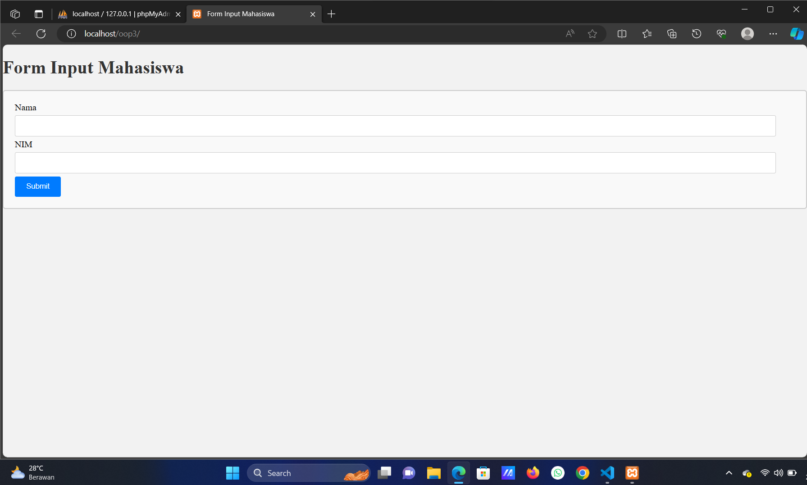

# TUGAS PRAKTIKUM CRUD-OOP-PHP WEEK 11

## Nama : Andi Mira Detavia
## NIM : 10221023
## Kelas : PBO A

### *Tugas :*
Buat form input nama dan nim mahasiswa (tanpa database) dengan mengaplikasikan namespace dan autoload composer. Aplikasikan juga Exception/Error Handling ketika nim yang diinput kurang dari 8 angka (sesuai dengan nim ITK : 10201054).

### *Tampilan :*



<br></br>


<br></br>


<br></br>

<br></br>

### *Code Source :*

### Membuat Namespace

#### Membuat folder APP 

##### -> Folder AnotherClass

```php
APP/AnotherClass/AnotherClass.php

<?php
    namespace AnotherClass;

    class AnotherClass {
        public function sayHello() {
            echo "Hello from AnotherClass in AnotherClass!\n";
        }
    }
?>
```
</br>

##### -> Folder MyClass
```php
APP/MyClass/MyClass.php

<?php

namespace MyClass;

class MyClass
{
    private $nama;
    private $nim;

    public function setNama($nama)
    {
        $this->nama = $nama;
    }

    public function setNim($nim)
    {
        if (preg_match('/^\d{8}$/', $nim)) {
            $this->nim = $nim;
        } else {
            throw new \InvalidArgumentException("Silahkan Periksa NIM Anda Kembali!");
        }
    }

    public function getNama()
    {
        return $this->nama;
    }

    public function getNim()
    {
        return $this->nim;
    }
}
```
</br>

### Membuat Autoload

#### Folder vendor 

##### Dimana folder vendor sendiri akan muncul setelah menginstall composer.

```php
vendor/Autoload.php

<?php

// autoload.php @generated by Composer

if (PHP_VERSION_ID < 50600) {
    if (!headers_sent()) {
        header('HTTP/1.1 500 Internal Server Error');
    }
    $err = 'Composer 2.3.0 dropped support for autoloading on PHP <5.6 and you are running '.PHP_VERSION.', please upgrade PHP or use Composer 2.2 LTS via "composer self-update --2.2". Aborting.'.PHP_EOL;
    if (!ini_get('display_errors')) {
        if (PHP_SAPI === 'cli' || PHP_SAPI === 'phpdbg') {
            fwrite(STDERR, $err);
        } elseif (!headers_sent()) {
            echo $err;
        }
    }
    trigger_error(
        $err,
        E_USER_ERROR
    );
}

require_once __DIR__ . '/composer/autoload_real.php';

return ComposerAutoloaderInitb0adfcdb3e9dcf779fa2d38662e46a69::getLoader();
```
</br>

### Membuat Tampilan

#### Membuat file index

```php
index.php

<?php

require 'vendor/Autoload.php';

use MyClass\MyClass;

$nama = $nim = '';
$error = '';

if ($_SERVER['REQUEST_METHOD'] === 'POST') {
    $myclass = new MyClass();
    
    try {
        $myclass->setNama($_POST['nama']);
        $myclass->setNim($_POST['nim']);
        
        $nama = $myclass->getNama();
        $nim = $myclass->getNim();
    } catch (Exception $e) {
        $error = "Error: " . $e->getMessage();
    }
}
?>

<!DOCTYPE html>
<html>
<head>
<style>
    /* style.css */

    /* Gaya untuk body (halaman) */
    body {
        font-family: Times New Roman, sans-serif;
        background-color: #f2f2f2;
        margin: 0;
        padding: 0;
    }

    /* Gaya untuk kontainer utama */
    .container {
        max-width: 800px;
        margin: 0 auto;
        padding: 20px;
        background-color: #fff;
        box-shadow: 0 0 10px rgba(0, 0, 0, 0.1);
    }

    /* Gaya untuk judul */
    h1 {
        color: #333;
    }

    /* Gaya untuk formulir input */
    form {
        background-color: #f9f9f9;
        padding: 20px;
        border: 2px solid #ccc;
        border-radius: 5px;
    }

    input[type="text"] {
        width: 96%;
        padding: 10px;
        margin: 5px 0;
        border: 1px solid #ccc;
        border-radius: 3px;
    }

    input[type="submit"] {
        background-color: #007BFF;
        color: #fff;
        border: none;
        padding: 10px 20px;
        border-radius: 3px;
        cursor: pointer;
    }

    input[type="submit"]:hover {
        background-color: #0056b3;
    }

    /* Gaya untuk pesan kesalahan */
    .error-message {
        color: #ff0000;
    }

    /* Gaya untuk tabel */
    table {
        width: 100%;
        border-collapse: collapse;
        margin-top: 20px;
    }

    th, td {
        border: 1px solid #ccc;
        padding: 8px;
        text-align: left;
    }

    th {
        background-color: #007BFF;
        color: #fff;
    }

    /* Gaya untuk tautan (link) */
    a {
        color: #007BFF;
        text-decoration: none;
    }

    a:hover {
        text-decoration: underline;
    }
    </style>
    <title>Form Input Mahasiswa</title>
</head>
<body>
    <h1>Form Input Mahasiswa</h1>
    <form method="POST" action="">
        Nama <input type="text" name="nama" required><br>
        NIM <input type="text" name="nim" required><br>
        <input type="submit" value="Submit">
    </form>

    <?php if (!empty($error)): ?>
    <p><?php echo $error; ?></p>
    <?php endif; ?>

    <?php if (!empty($nama) && !empty($nim)): ?>
    <h2>Hasil Input:</h2>
    <p>Nama <?php echo $nama; ?></p>
    <p>NIM <?php echo $nim; ?></p>
    <?php endif; ?>
</body>
</html>
```
</br>

#### Membuat file css

```css
style.css
    /* style.css */

    /* Gaya untuk body (halaman) */
    body {
        font-family: Times New Roman, sans-serif;
        background-color: #4d33e2;
        margin: 0;
        padding: 0;
    }

    /* Gaya untuk kontainer utama */
    .container {
        max-width: 800px;
        margin: 0 auto;
        padding: 20px;
        background-color: #fff;
        box-shadow: 0 0 10px rgba(0, 0, 0, 0.1);
    }

    /* Gaya untuk judul */
    h1 {
        color: #333;
    }

    /* Gaya untuk formulir input */
    form {
        background-color: #f9f9f9;
        padding: 20px;
        border: 1px solid #ccc;
        border-radius: 5px;
    }

    input[type="text"] {
        width: 96%;
        padding: 10px;
        margin: 5px 0;
        border: 1px solid #ccc;
        border-radius: 3px;
    }

    input[type="submit"] {
        background-color: #007BFF;
        color: #fff;
        border: none;
        padding: 10px 20px;
        border-radius: 3px;
        cursor: pointer;
    }

    input[type="submit"]:hover {
        background-color: #0056b3;
    }

    /* Gaya untuk pesan kesalahan */
    .error-message {
        color: #ff0000;
    }

    /* Gaya untuk tabel */
    table {
        width: 100%;
        border-collapse: collapse;
        margin-top: 20px;
    }

    th, td {
        border: 1px solid #ccc;
        padding: 8px;
        text-align: left;
    }

    th {
        background-color: #007BFF;
        color: #fff;
    }

    /* Gaya untuk tautan (link) */
    a {
        color: #007BFF;
        text-decoration: none;
    }

    a:hover {
        text-decoration: underline;
    }
```